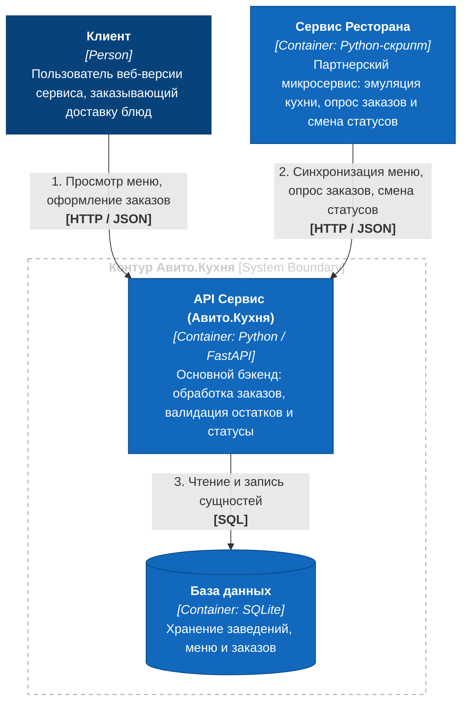

# Авито.Кухня (MVP Backend Service)

Сервис заказа и доставки еды для платформы «Авито». Репозиторий содержит реализацию основного REST API для клиентов и партнеров, а также микросервис-симулятор партнерского заведения.

---

## 📌 Бизнес-сценарии и пользовательский путь (CJM)

Сервис спроектирован на основе ключевых сценариев взаимодействия клиентов и ресторанов-партнеров:
1. **Клиент (Happy Path):** получение актуального меню заведения, выбор доступных позиций и оформление заказа со статусом `created`.
2. **Клиент (Negative Path):** попытка добавления позиции из стоп-листа (is_available = false) с возвратом валидационной ошибки `400 Bad Request`.
3. **Ресторан (Синхронизация):** выгрузка позиций меню на платформу через публичный API.
4. **Ресторан (Обработка заказа):** автоматический опрос новых заказов, перевод в процесс готовки (`cooking`) и фиксация готовности к выдаче (`ready_for_pickup`).

> 📊 Полные интерактивные sequence-диаграммы (Mermaid) для каждого шага вынесены в отдельный документ:  
> 🔗 **[Открыть схемы пользовательских путей (docs/cjm.md)](docs/cjm.md)**

---

## 🏛 Архитектура системы (C4 Model — Level 2)

Система спроектирована по микросервисной архитектуре и состоит из двух независимых сервисов, взаимодействующих по протоколу HTTP через изолированную сеть Docker Compose:

* **API Сервис (Авито.Кухня)** — основной бэкенд на Python (FastAPI). Отвечает за прием клиентских заказов, валидацию позиций в стоп-листах и управление статусами.
* **База данных (SQLite)** — встраиваемое хранилище данных MVP, обеспечивающее персистентность меню, ресторанов и заказов.
* **Сервис Ресторана** — автономный фоновый микросервис на Python. Эмулирует реальное заведение: регистрирует меню, периодически опрашивает новые заказы и переводит их в статус готовности с временной задержкой.

