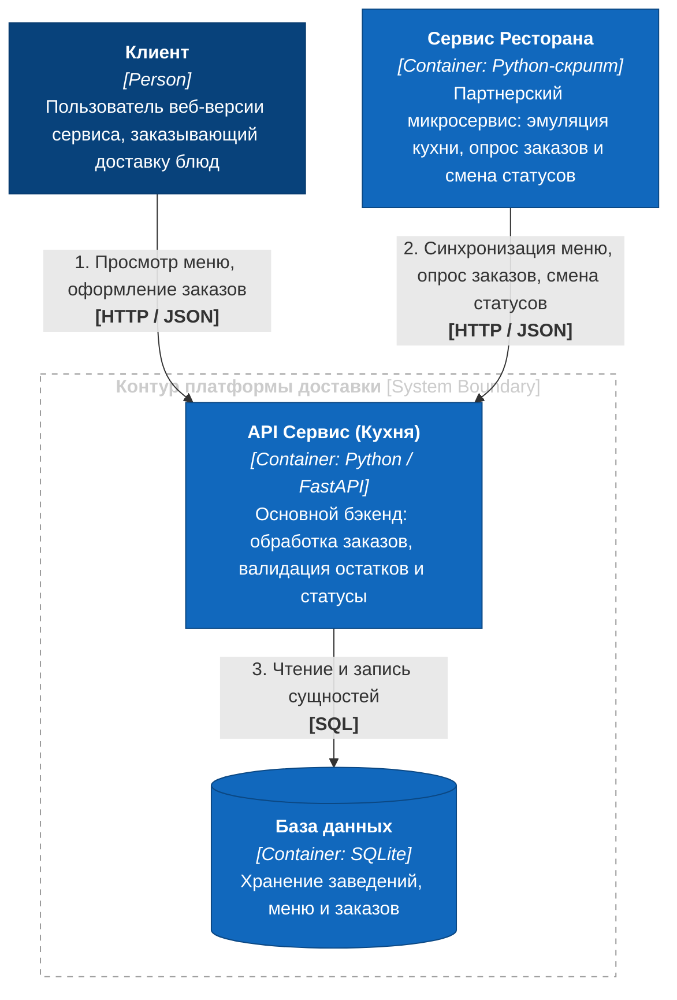
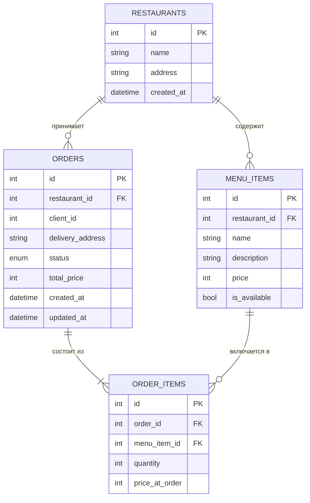

# Delivery Kitchen API (MVP Backend Service)

Сервис заказа и доставки еды для платформы с симулятором кухни партнерских заведений. Репозиторий содержит реализацию основного REST API для клиентов и партнеров, а также микросервис-симулятор партнерского заведения.

---

## 📌 Бизнес-сценарии и пользовательский путь (CJM)

Сервис спроектирован на основе ключевых сценариев взаимодействия клиентов и ресторанов-партнеров:
1. **Клиент (Happy Path):** получение актуального меню заведения, выбор доступных позиций и оформление заказа со статусом `created`.
2. **Клиент (Negative Path):** попытка добавления позиции из стоп-листа (is_available = false) с возвратом валидационной ошибки `400 Bad Request`.
3. **Ресторан (Синхронизация):** выгрузка позиций меню на платформу через публичный API.
4. **Ресторан (Обработка заказа):** автоматический опрос новых заказов, перевод в процесс готовки (`cooking`) и фиксация готовности к выдаче (`ready_for_pickup`).

> 📊 Полные интерактивные sequence-диаграммы (Mermaid) для каждого шага вынесены в отдельный документ:  
> 🔗 **[Открыть схемы пользовательских путей (docs/cjm.md)](docs/cjm.md)**

---

## 🏛 Архитектура системы (C4 Model — Level 2)

Система спроектирована по микросервисной архитектуре и состоит из двух независимых сервисов, взаимодействующих по протоколу HTTP через изолированную сеть Docker Compose:

* **API Сервис (Кухня)** — основной бэкенд на Python (FastAPI). Отвечает за прием клиентских заказов, валидацию позиций в стоп-листах и управление статусами.
* **База данных (SQLite)** — встраиваемое хранилище данных MVP, обеспечивающее персистентность меню, ресторанов и заказов.
* **Сервис Ресторана** — автономный фоновый микросервис на Python. Эмулирует реальное заведение: регистрирует меню, периодически опрашивает новые заказы и переводит их в статус готовности с временной задержкой.


---

## Схема базы данных

В качестве СУБД на этапе MVP используется SQLite с управлением миграциями через Alembic. 

### ER-диаграмма связей



---

### Описание сущностей и таблиц

* **`restaurants`** — заведения, подключенные к платформе:
  * `id` (INTEGER, PK) — уникальный идентификатор заведения.
  * `name` (VARCHAR) — наименование ресторана.
  * `address` (VARCHAR) — фактический адрес.
  * `created_at` (DATETIME) — дата и время подключения к сервису.

* **`menu_items`** — блюда и позиции меню заведений:
  * `id` (INTEGER, PK) — уникальный идентификатор позиции.
  * `restaurant_id` (INTEGER, FK -> `restaurants.id`, `ON DELETE CASCADE`) — привязка блюда к заведению.
  * `name` (VARCHAR) — название блюда.
  * `description` (VARCHAR, NULL) — опциональное описание состава.
  * `price` (INTEGER) — текущая базовая стоимость в копейках.
  * `is_available` (BOOLEAN) — признак доступности для заказа (управление стоп-листом).

* **`orders`** — клиентские заказы:
  * `id` (INTEGER, PK) — номер заказа.
  * `restaurant_id` (INTEGER, FK -> `restaurants.id`, `ON DELETE CASCADE`) — заведение, исполняющее заказ.
  * `client_id` (INTEGER) — идентификатор пользователя (авторизация вынесена за рамки MVP).
  * `delivery_address` (VARCHAR) — адрес доставки.
  * `status` (ENUM) — жизненный цикл заказа (`created`, `cooking`, `ready_for_pickup`, `completed`, `cancelled`).
  * `total_price` (INTEGER) — финальная стоимость заказа в копейках.
  * `created_at` (DATETIME) — метка времени оформления.
  * `updated_at` (DATETIME) — метка времени последней смены статуса.

* **`order_items`** — состав конкретного чека:
  * `id` (INTEGER, PK) — идентификатор позиции в заказе.
  * `order_id` (INTEGER, FK -> `orders.id`, `ON DELETE CASCADE`) — привязка к заказу.
  * `menu_item_id` (INTEGER, FK -> `menu_items.id`, `ON DELETE RESTRICT`) — привязка к исходному блюду из меню.
  * `quantity` (INTEGER) — количество единиц товара.
  * `price_at_order` (INTEGER) — зафиксированная цена единицы товара на момент покупки в копейках.

---

### Архитектурные решения в схеме данных

* **Хранение денежных средств в целых числах (`Integer`):**
  * Все финансовые поля (`price`, `total_price`, `price_at_order`) хранятся в неделимых единицах (копейках). Это исключает погрешности вычислений чисел с плавающей точкой (`Float`/`Double`).
* **Снимок цены (`price_at_order`):**
  * Цена единицы товара фиксируется в `order_items` в момент покупки. Последующие изменения цен рестораном в таблице `menu_items` не искажают исторические данные и финансовую отчетность по ранее выполненным заказам.
* **Стратегии целостности связей (`Foreign Keys`):**
  * `ON DELETE CASCADE` для связей ресторана и блюд/заказов: при удалении тестового заведения из системы автоматически очищаются зависимые позиции меню и заказы.
  * `ON DELETE RESTRICT` для позиций в чеке (`order_items.menu_item_id`): запрещает удаление блюда из базы, если оно уже фигурирует в ранее оформленных заказах пользователей. Для вывода блюда из продажи предусмотрен флаг `is_available = False`.

  ## ⚙️ Допущенные упрощения и архитектурные решения

* **Выбор СУБД (SQLite) и синхронный режим работы:**
  * Для этапа прототипа выбрана встраиваемая база данных SQLite, что позволяет развернуть систему без создания сторонних сетевых узлов и внешних зависимостей.
  * Запросы выполняются в синхронном режиме через пул потоков FastAPI. В production-контуре для масштабирования запланирован переход на клиент-серверную СУБД (PostgreSQL) с асинхронным драйвером (`asyncpg`) без изменения интерфейсов репозиториев.
* **Идентификация и авторизация пользователей:**
  * В рамках требований ТЗ авторизация пользователей и заведений опущена. Идентификатор клиента (`client_id`) передается напрямую в теле заказа.
* **Эмуляция производственного цикла кухни:**
  * Время физического приготовления блюд поварами эмулируется задержкой таймера (`sleep`) в партнерском сервисе.
* **Конечный автомат статусов (State Machine):**
  * Жизненный цикл заказа защищен матрицей допустимых переходов (`created` $\rightarrow$ `cooking` $\rightarrow$ `ready_for_pickup` $\rightarrow$ `completed` / `cancelled`), что исключает невалидные скачки состояний.

---

## 🚀 Инструкция по запуску

### 1. Запуск через Docker Compose (Рекомендуемый способ)

Для старта всей системы с нуля требуется только запущенный **Docker Desktop**.

1. **Запустить сервисы:**
   ```bash
   docker compose up --build
   ```
   *Контейнер `avito-kitchen` автоматически накатит все миграции Alembic на SQLite-базу в Docker volume и запустит REST API на порту 8000. Контейнер `restaurant-service` дождется доступности API, зарегистрирует тестовый ресторан («Додо Пицца»), загрузит начальное меню и перейдет в режим опроса заказов.*

2. **Открыть интерактивную документацию Swagger UI:**
   Перейдите в браузере по адресу: **[http://localhost:8000/docs](http://localhost:8000/docs)**.

3. **Остановить контейнеры:**
   ```bash
   docker compose down
   ```

---

### 2. Сценарий быстрой проверки через Swagger UI

1. **Просмотр меню и стоп-листа:**
   * Выполните `GET /api/v1/restaurants/1/menu`.
   * В ответе отобразятся доступные пиццы (`is_available: true`) и напиток в стоп-листе (`is_available: false`).
2. **Проверка стоп-листа (Negative Path):**
   * Выполните `POST /api/v1/orders` с блюдом из стоп-листа (`menu_item_id: 3`):
     ```json
     {
       "restaurant_id": 1,
       "client_id": 10,
       "delivery_address": "ул. Ленина, д. 1",
       "items": [{"menu_item_id": 3, "quantity": 1}]
     }
     ```
   * Сервер вернет ошибку **`400 Bad Request`** с пояснением, что позиция недоступна.
3. **Оформление заказа и цикл кухни (Happy Path):**
   * Отправьте `POST /api/v1/orders` с доступным блюдом (`menu_item_id: 1`).
   * Сервер вернет **`201 Created`** со статусом `"created"` и рассчитанной суммой чека в копейках.
   * В логах консоли Docker отобразится работа партнерского микросервиса: заказ подхватится в статус `cooking`, выдержится пауза приготовления 5 секунд и перейдет в `ready_for_pickup`.

---

### 3. Локальный запуск без Docker (для разработки)

1. **Установить зависимости с помощью `uv`:**
   ```bash
   uv sync
   ```
2. **Применить миграции базы данных:**
   ```bash
   uv run alembic upgrade head
   ```
3. **Запустить сервер API:**
   ```bash
   uv run uvicorn app.main:app --reload --port 8000
   ```
4. **Запустить эмулятор кухни (во втором терминале):**
   ```bash
   uv run restaurant_service/app.py
   ```
5. **Проверить качество кода линтером:**
   ```bash
   uv run ruff check .
   ```

---
