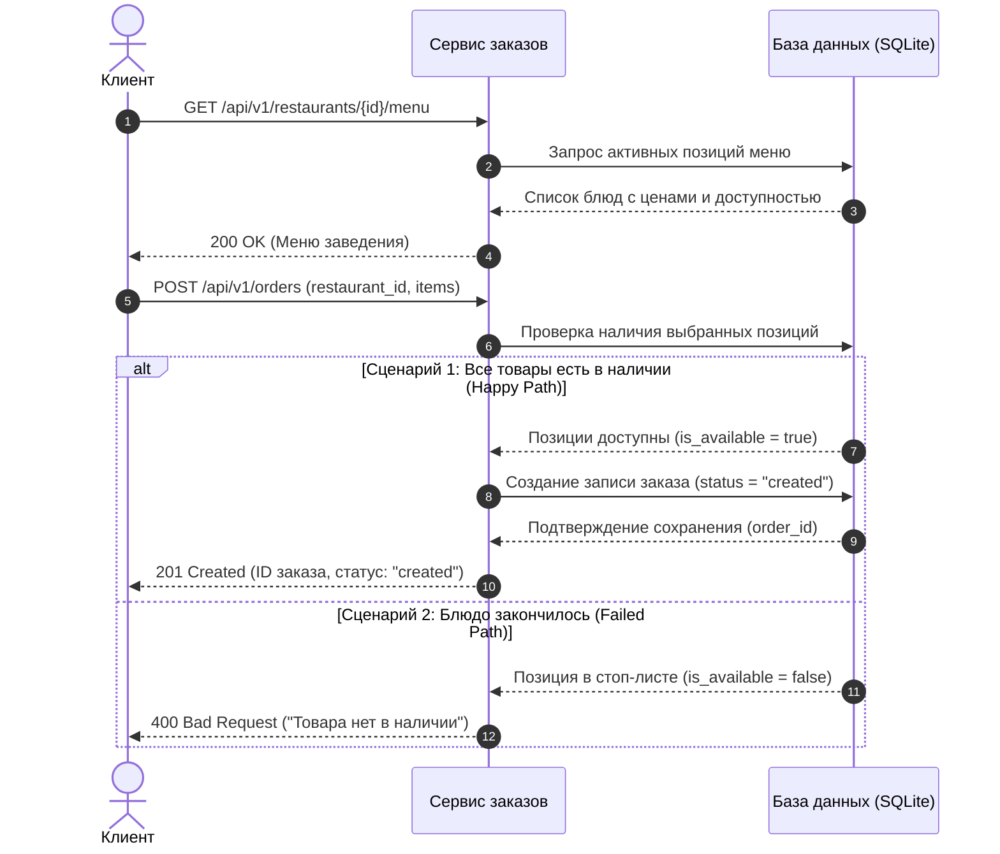
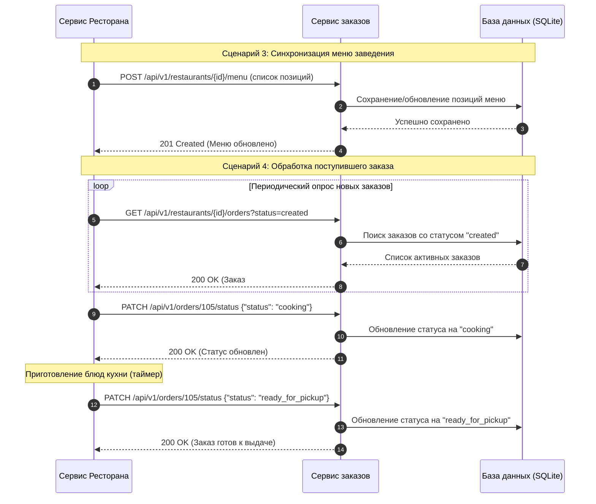

# Пользовательские пути (CJM)

## 1. Сценарий клиента (Client Journey)

```mermaid
sequenceDiagram
    autonumber
    actor Client as Клиент
    participant API as Сервис заказов
    participant DB as База данных (SQLite)

    %% 1. Получение меню
    Client->>API: GET /api/v1/restaurants/{id}/menu
    API->>DB: Запрос активных позиций меню
    DB-->>API: Список блюд с ценами и доступностью
    API-->>Client: 200 OK (Меню заведения)

    %% 2. Попытка оформления
    Client->>API: POST /api/v1/orders (restaurant_id, items)
    API->>DB: Проверка наличия выбранных позиций

    alt Сценарий 1: Все товары есть в наличии (Happy Path)
        DB-->>API: Позиции доступны (is_available = true)
        API->>DB: Создание записи заказа (status = "created")
        DB-->>API: Подтверждение сохранения (order_id)
        API-->>Client: 201 Created (ID заказа, статус: "created")
    else Сценарий 2: Блюдо закончилось (Failed Path)
        DB-->>API: Позиция в стоп-листе (is_available = false)
        API-->>Client: 400 Bad Request ("Товара нет в наличии")
    end
```

---

## 2. Сценарий заведения (Restaurant Journey)

```mermaid
sequenceDiagram
    autonumber
    participant Rest as Сервис Ресторана
    participant API as Сервис заказов
    participant DB as База данных (SQLite)

    Note over Rest, DB: Сценарий 3: Синхронизация меню заведения
    Rest->>API: POST /api/v1/restaurants/{id}/menu (список позиций)
    API->>DB: Сохранение/обновление позиций меню
    DB-->>API: Успешно сохранено
    API-->>Rest: 201 Created (Меню обновлено)

    Note over Rest, DB: Сценарий 4: Обработка поступившего заказа
    loop Периодический опрос новых заказов
        Rest->>API: GET /api/v1/restaurants/{id}/orders?status=created
        API->>DB: Поиск заказов со статусом "created"
        DB-->>API: Список активных заказов
        API-->>Rest: 200 OK (Заказ #105)
    end

    Rest->>API: PATCH /api/v1/orders/105/status {"status": "cooking"}
    API->>DB: Обновление статуса на "cooking"
    API-->>Rest: 200 OK (Статус обновлен)

    Note over Rest: Приготовление блюд кухни (таймер)

    Rest->>API: PATCH /api/v1/orders/105/status {"status": "ready_for_pickup"}
    API->>DB: Обновление статуса на "ready_for_pickup"
    API-->>Rest: 200 OK (Заказ готов к выдаче)
```